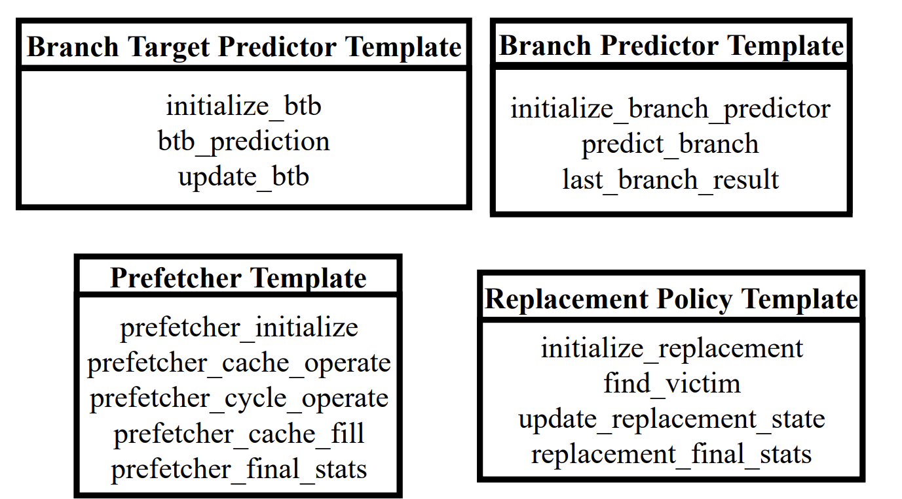
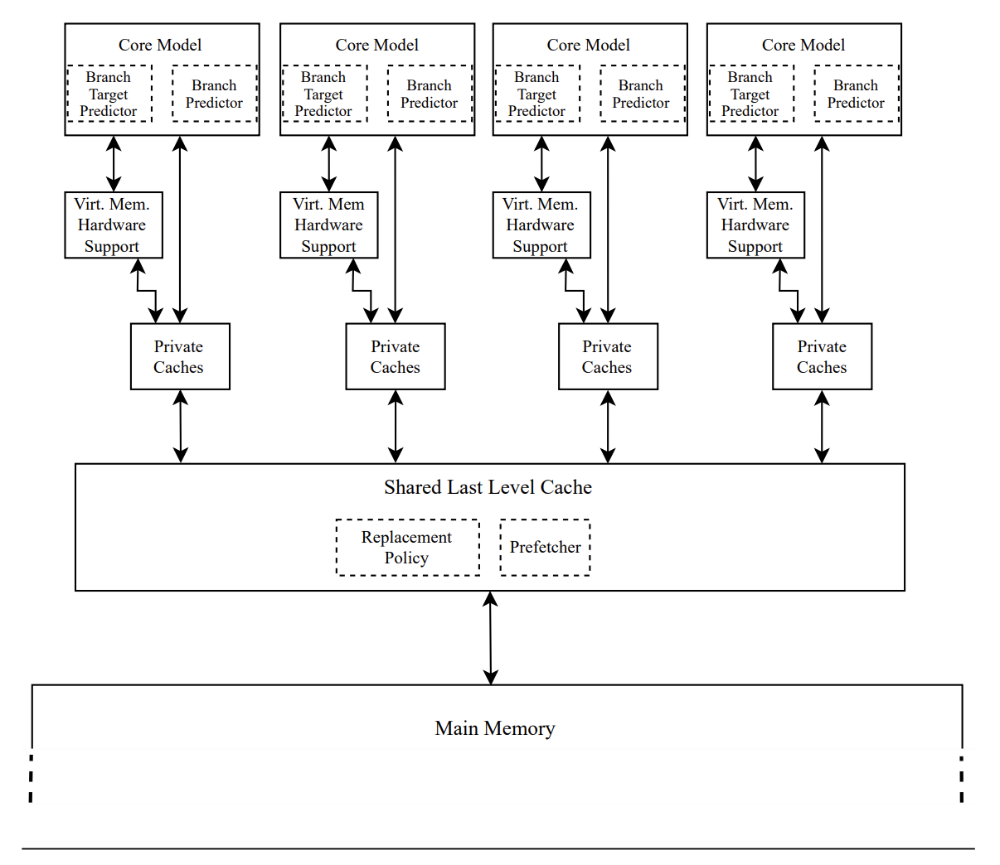
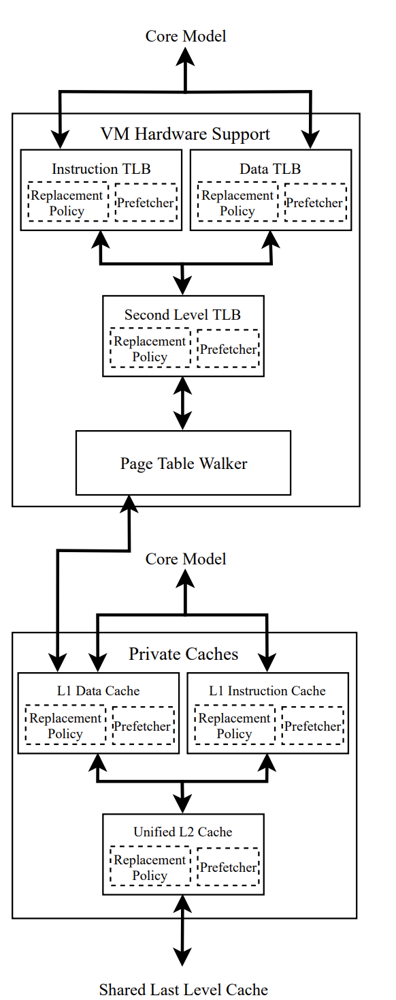
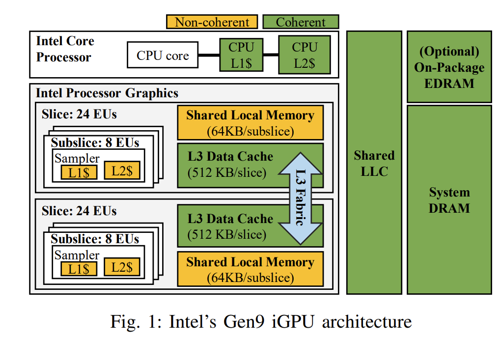
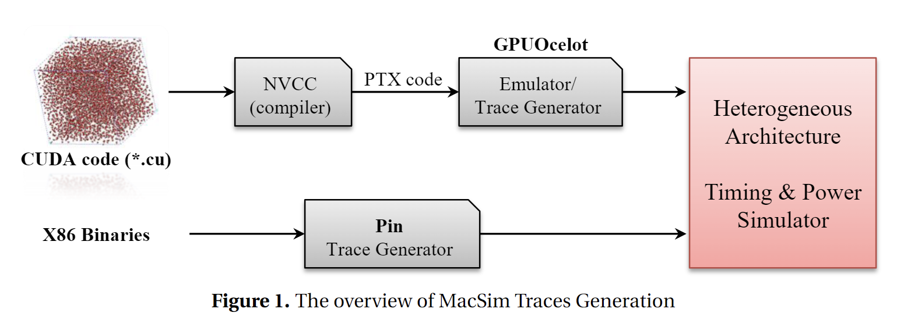

# trace-driven simulator分析

## ChampSim

### 整体描述

没有提到速度和精度，默认很慢和不准，支持warmup，整体有4大组成部分

模拟多核系统，每个核自带独立的分支预测，每个核都各自支持独立的tlb + L1-cache

TLB架构如下，分为多级，倒是可以和香山的进行适配

 

总结，架构比较精简，值得参考，速度慢，需要投入人力进行优化。

### 代码风格

1. 有充分的测试，位于ChampSim/test/cpp/src，值得借鉴
2. 支持trace的格式转换，位于ChampSim/tracer/cvp_converter/cvp2champsim.cc
3. 功能与时序解耦，使用current_cycle 测量ipc

## macsim

### 整体描述

参考 [ispass18 paper](https://hparch.gatech.edu/papers/gera_ispass18.pdf)

能够支持模拟GPU架构，所以BPU没有体现，但是如果考虑到加速器的移植，确实是利器。论文中设计的GPU架构如下图：

Trace generator + Emulator => Timing + Power Simulation

### 代码风格

1. 文档比较详细
2. rwqueue缺失，无法运行
3. 代码风格条理清晰，比champsim的抽象能力更好，支持bpu miss recover，但是需要基于时序
4. 接入ramulator

## scarab

### 整体描述

看的champsim论文，提到Scarab 适合更高级的架构师使用，可能不适合学生。由intel pin-tools驱动，支持ramulator接口，内存可配置。当前仅支持x86指令。

Fast: 600 KIPS trace-driven, 100 KIPS exec-driven

Wrong path simulation

Cache Hierarchy (Private L1, Private MLC, Private/Shared LLC)

Ramulator Memory Simulator (DDR3/4, LPDDR3/4, GDDR5, HBM, WideIO/2, and more...)

Interface to McPat and CACTI for system level power/energy modeling

Support for DVFS

Latest Branch Predictors and Data Prefetchers (TAGE-SC-L, Stride, Stream, 2dc, GHB, Markov, and more...)

### 代码风格

1. 可读性较高
2. 耦合度低，易于移植
3. .def的写法可以参考

## 总结

编写demo从champsim入手，后续根据需求选择scarab / macsim的风格进行改进

